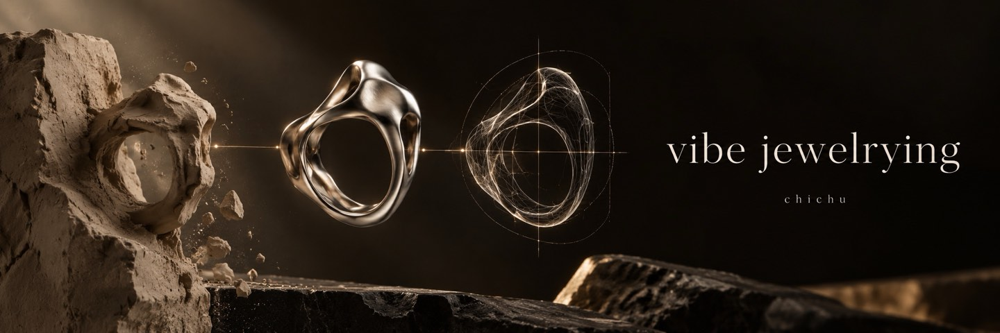

# vibe jewelrying

**[▶ 在线浏览](https://xing0325.github.io/anima-rings/)** · 无需登录 · AI 珠宝概念与网页展示

“珠宝”的英文是 jewelry。我把这次尝试叫作 **vibe jewelrying**：从大理银饰店里的好奇心出发，晚上回去用 AI 和 Blender 试着做自己的银饰概念。

## 怎么看

打开页面，向下浏览戒指的造型、材质气氛与细节呈现。这里展示的是概念设计和网页表达，不是已经量产、可下单的实物商品。封面也是概念图。

## 起点：在银饰店里多问了几句

我在大理逛银饰店时，接触到失蜡和打磨这些制作环节，开始好奇：一个人能不能借助 AI，把脑子里的首饰想法推进到三维模型和视觉表达？

此前做 Zima3D 时遇到的挫折，让我知道“生成一个看起来像的东西”和得到可继续处理的模型之间有差别。这次我把兴趣收得更具体，从银饰形态入手，再用网页把它们组织成能被浏览的作品。

## 遇到的问题与收获

最难的不是生成一张好看的图，而是跨过图像、三维形态与真实工艺之间的距离。表面上成立的结构，未必经得住制造和佩戴。现阶段我保留这个界限，没有把 AI 概念包装成已经完成工艺验证的成品。

我发过“高三暑假用 AI 做银饰”的内容，收到了设计师和工厂希望交流合作的反馈。这让我第一次感到，自己的兴趣实验可能接上真实行业；这些反馈本身并不代表合作已经落地或产品已经售出。

## 项目范围

本仓库是这一探索中的静态展示页面。它强调造型、氛围与叙事，不提供支付或实际订单服务。参考设计与第三方资源仍保留其原有权利，不把网页中的所有素材都宣称为手工原创。

## 本地预览

在根目录运行 `python3 -m http.server 4173`，打开 `http://localhost:4173/`。

## 开发与资料

原有技术说明、目录结构与运行步骤保留在 [开发文档](docs/DEVELOPMENT.md)。其中相对文件路径以仓库根目录为准。

---

[刘行 / chichu 的作品集](https://github.com/xing0325) · 封面为 AI 生成概念图，实际功能以项目界面与说明为准。
